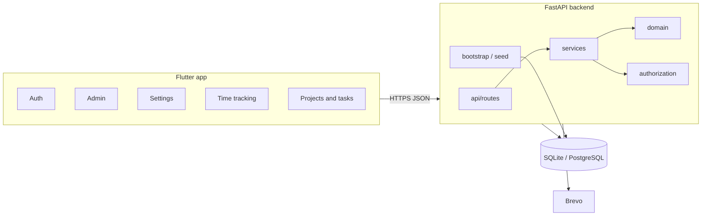
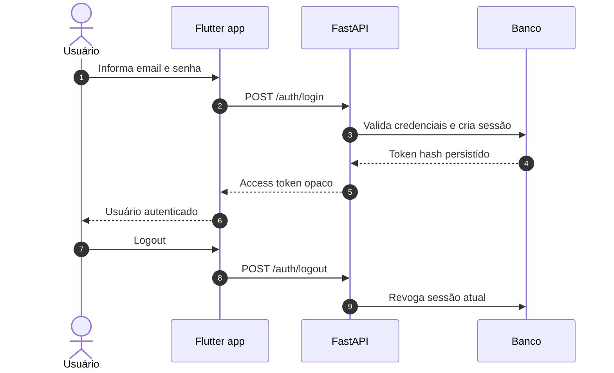
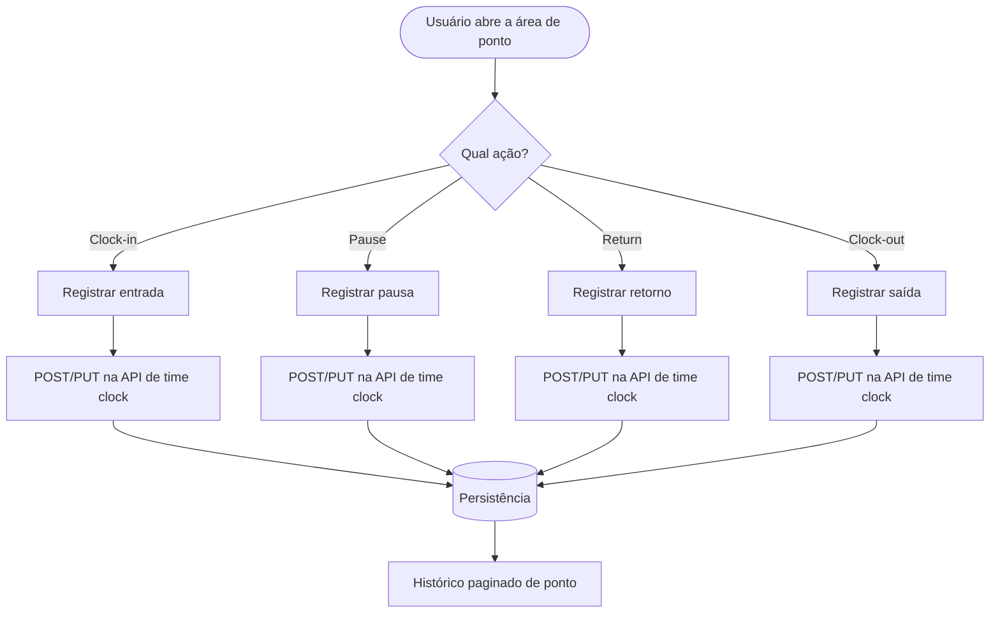
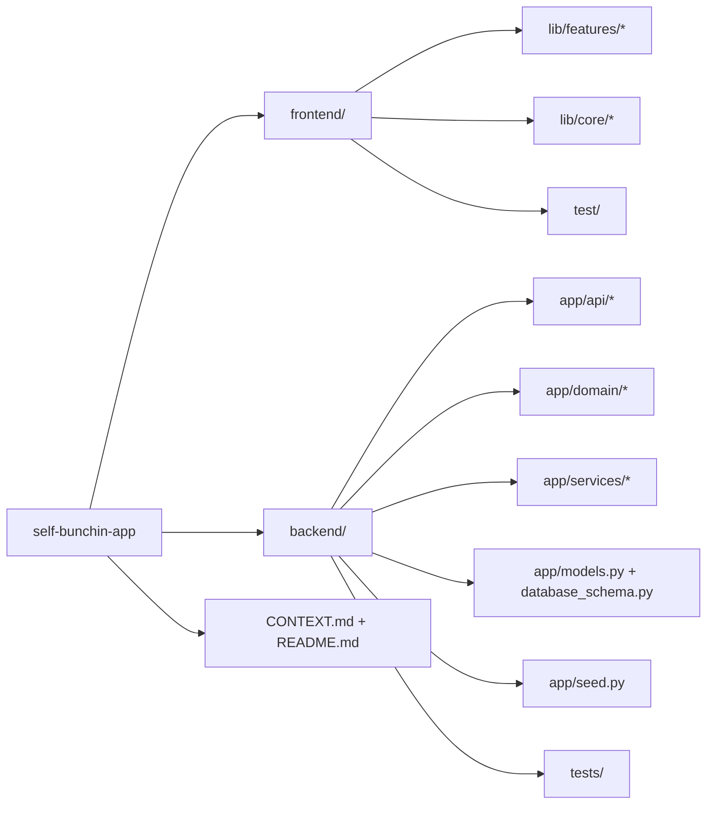

# Bunchin App

<p align="left">
  
  
  
  
  
  
  
</p>

Sistema de ponto eletrônico e gestão de equipe com frontend em Flutter e backend em FastAPI. O foco do repositório é um fluxo corporativo enxuto, com autenticação por token opaco, proteção de dados sensíveis em nível de aplicação e uma base pensada para evoluir sem acoplamento desnecessário.

## Visão Geral

O Bunchin App reúne:

- app Flutter para operação diária, autenticação, configurações e time tracking
- API FastAPI para autenticação, funcionários, projetos, admin e ponto
- persistência local com SQLite em desenvolvimento e PostgreSQL em ambientes superiores
- criptografia de PII antes da persistência e sessões rastreáveis por token hash

Para detalhes da API e dos contratos do backend, veja [backend/README.md](backend/README.md).

## Arquitetura



## Diagramas Úteis

### Fluxo de autenticação



Observação de sessão:

- `keepConnected=true` pede o TTL longo no backend.
- `keepConnected=false` pede o TTL curto, mas a sessão ainda fica armazenada localmente e pode ser reaproveitada até `expiresAt`.
- `POST /api/v1/auth/logout` continua sendo o caminho para revogação imediata.

### Fluxo de ponto



### Mapa do repositório



## Recursos Principais

| Área | O que cobre |
| --- | --- |
| Autenticação | Login, logout, sessão persistida e revogação individual |
| Ponto | Clock-in, clock-out, pausa, retorno e histórico paginado |
| Gestão de equipe | CRUD de funcionários, vínculo com projetos e regras por papel |
| Projetos e tarefas | CRUD gerencial de projetos, tarefas hierárquicas, tipos, capacidade e participação de funcionários |
| Admin | Operação interna com permissões separadas |
| Configurações | Tema global com modos claro, escuro e seguir sistema |
| E-mail transacional | Fluxos de convite, redefinição e boas-vindas via Brevo |
| Segurança | PII criptografada, token opaco com hash e CORS configurável |

## Stack

### Backend

| Tecnologia | Uso |
| --- | --- |
| Python | Linguagem principal |
| FastAPI | API REST |
| SQLAlchemy | ORM |
| Pydantic | Schemas e validação |
| Cryptography | AES-GCM para PII |
| Pytest | Testes |
| SQLite | Banco local |
| PostgreSQL | Banco de produção/staging |

### Frontend

| Tecnologia | Uso |
| --- | --- |
| Flutter | UI mobile/web |
| Dart | Linguagem |
| Freezed | Modelos imutáveis |
| Build Runner | Geração de código |
| Flutter Secure Storage | Persistência segura |
| Geolocator | Geolocalização |
| HTTP | Cliente HTTP |
| Google Fonts | Tipografia |

## Estrutura

```text
backend/
  app/
    api/
    domain/
    schemas/
    services/
    main.py
    bootstrap.py
    database_schema.py
  tests/
  .env.example
  requirements.txt

frontend/
  lib/
    core/
    features/
      projects/
    theme/
    main.dart
  test/
  pubspec.yaml
```

## Início Rápido

### Backend

```bash
cd backend
python -m venv .venv
.venv/bin/activate
pip install -r requirements.txt
cp .env.example .env
uvicorn app.main:app --reload
```

### Frontend

```bash
cd frontend
flutter pub get
dart run build_runner build
flutter run -d web-server
```

## Deploy no Vercel

O frontend pode ser publicado como site estático no Vercel usando o diretório `frontend/` como root do projeto.

### Configuração esperada

- Root Directory: `frontend`
- Build Command: `bash scripts/vercel-build.sh`
- Output Directory: `build/web`
- Environment Variable: `API_BASE_URL` com a URL pública da API, por exemplo `https://api.suaempresa.com/api/v1`
- O backend precisa permitir o origin do domínio do Vercel em `BUNCHIN_ALLOWED_ORIGINS`

O build script baixa o Flutter SDK quando necessário, gera o web build e falha com mensagem clara se o `API_BASE_URL` não estiver definido no ambiente do Vercel.

## Configuração

As variáveis mais importantes são:

- `BUNCHIN_TOKEN_SECRET`
- `BUNCHIN_ENCRYPTION_SECRET`
- `BUNCHIN_ALLOWED_ORIGINS`
- `BUNCHIN_ENFORCE_HTTPS`
- `BUNCHIN_SEED_ON_STARTUP`
- `BUNCHIN_SEED_ADMIN_PASSWORD`
- `BUNCHIN_BREVO_API_KEY`
- `BUNCHIN_BREVO_SENDER_EMAIL`
- `BUNCHIN_BREVO_SENDER_NAME`
- `BUNCHIN_BREVO_WELCOME_ENABLED`
- `API_BASE_URL` para o frontend web publicado no Vercel

O backend também documenta seed, autenticação, permissões e endpoints em [backend/README.md](backend/README.md).

## API

- Base path: `/api/v1`
- Formato: JSON
- Autenticação: `Authorization: Bearer <token>`
- Erros: `{"detail":"mensagem"}`

Rotas principais:

- `/auth/login`
- `/auth/logout`
- `/employees`
- `/projects`
- `/time-clock`
- `/time-clock/me?page=&limit=`
- `/time-clock/employees/{employee_id}/punches?page=&limit=`
- `/admin`

## Validação

O CI do repositório executa:

- `pytest` em `backend/`
- `flutter test` em `frontend/`

Comandos úteis localmente:

```bash
cd backend && pytest
cd frontend && flutter test
cd frontend && dart format lib test
```

## Documentação

- [backend/README.md](backend/README.md) - detalhes da API, seed e permissões
- [CONTEXT.md](CONTEXT.md) - regras e contexto compartilhado do projeto

## Licença

Uso proprietário. Consulte o repositório ou o time responsável para detalhes de distribuição.
